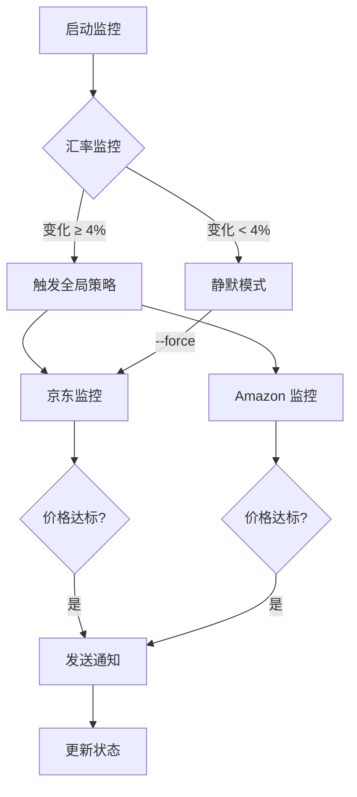

# 🌍 全球资产监控系统 (Global Asset Monitor)
---
title: Global Asset Monitor
emoji: 🎁
colorFrom: blue
colorTo: green
sdk: streamlit
sdk_version: 1.28.0
app_file: app.py
pinned: false
---

一个专业的模块化监控系统，用于追踪汇率、电商折扣及机票价格，具备高度的健壮性和扩展性。

## ✨ 核心特性

### ⚠️ 重要提示：汇率监控版本选择

**如果你在中国大陆用人民币换美元，请务必使用 `fx_monitor_cn`（中国版）！**

- ✅ **fx_monitor_cn**（中国版）：监控各银行的**实际挂牌价**（现汇卖出价）
- ⚠️ **fx_monitor**（国际版）：监控国际市场汇率，**不是**你能换到的价格

详细说明请查看：
- 📘 [汇率监控专项说明](FX_MONITOR_GUIDE_CN.md)
- 📊 [版本对比表](FX_VERSION_COMPARISON.md)

### 1. 插件化架构
- 基于抽象基类 `BaseMonitor` 的插件系统
- 支持在 `config.yaml` 中一键开关监控项
- 易于扩展新的监控类型

### 2. 智能汇率监控
- **180天 Z-Score 模型**：统计学分析汇率异常波动
- **4% 硬性门槛**：触发全局消费策略调整
- **静默模式**：汇率未达到门槛时跳过商品监控（节省资源）

### 3. 京东自营监控
- 专为京东 H5 移动端优化（规避 PC 端反爬）
- 检测"自营"、"百亿补贴"、"秒杀"标识
- 价格低于心理价位时自动提醒
- 随机延迟 + 移动端 Header 防封禁

### 4. Amazon 商品监控
- 支持 ASIN 和 URL 监控
- 多区域支持（US/UK/DE/JP）
- Apple Gift Card 专项监控

### 5. 全局策略引擎
- **汇率联动**：
  - 人民币贬值 → 增加京东巡检频率
  - 人民币升值 → 推荐 Amazon 购物
- 智能消费建议

### 6. 智能通知系统
- Brevo 邮件集成（HTML 格式）
- 一键直达按钮
- 多级通知（Level 1-3）
- 价格差值显示

## 📂 项目结构

```
global-asset-monitor/
├── monitors/                    # 监控器模块
│   ├── base_monitor.py         # 抽象基类
│   ├── fx_monitor.py           # 汇率监控（Z-Score）
│   ├── jd_monitor.py           # 京东自营监控
│   ├── amazon_monitor.py       # Amazon 监控
│   └── flight_monitor.py       # 机票监控（框架）
├── utils/                       # 工具模块
│   ├── anti_crawler.py         # 反爬虫工具
│   ├── notifier.py             # Brevo 邮件通知
│   ├── persistence.py          # 状态持久化
│   └── global_strategy.py      # 全局策略引擎
├── config.yaml                  # 配置文件
├── main.py                      # 定时任务入口
├── app.py                       # Streamlit 界面
├── requirements.txt
├── Dockerfile
└── README.md
```

## 🚀 快速开始

### 1. 安装依赖

```bash
pip install -r requirements.txt
```

### 2. 配置环境变量

复制 `.env.example` 为 `.env` 并填入你的配置：

```bash
cp .env.example .env
```

编辑 `.env`：

```env
BREVO_API_KEY=your_brevo_api_key_here
RECIPIENT_EMAIL=your_email@gmail.com
```

### 3. 配置监控项

编辑 `config.yaml`，填入你要监控的商品：

```yaml
jd_monitor:
  enabled: true
  products:
    - sku_id: "100012345678"
      name: "罗技 G304 无线游戏鼠标"
      expected_price: 199.0
```

### 4. 运行监控

```bash
# 手动触发一次检查
python main.py

# 强制运行（忽略静默模式）
python main.py --force

# 发送测试邮件
python main.py --test-email
```

### 5. 启动 Dashboard

```bash
streamlit run app.py
```

访问 `http://localhost:8501` 查看监控面板。

## 🐳 Docker 部署

### 构建镜像

```bash
docker build -t global-asset-monitor .
```

### 运行容器

```bash
docker run -d \
  -p 8501:8501 \
  -e BREVO_API_KEY=your_key \
  -e RECIPIENT_EMAIL=your_email@gmail.com \
  -v $(pwd)/config.yaml:/app/config.yaml \
  -v $(pwd)/last_check.json:/app/last_check.json \
  global-asset-monitor
```

## ☁️ Hugging Face Spaces 部署

1. 创建 Hugging Face Space（Streamlit）
2. 上传项目文件
3. 在 Settings 中添加环境变量：
   - `BREVO_API_KEY`
   - `RECIPIENT_EMAIL`
4. 自动部署完成

## 🔧 GitHub Actions 定时任务

创建 `.github/workflows/monitor.yml`：

```yaml
name: Asset Monitor

on:
  schedule:
    - cron: '0 */6 * * *'  # 每6小时运行一次
  workflow_dispatch:  # 手动触发

jobs:
  monitor:
    runs-on: ubuntu-latest
    steps:
      - uses: actions/checkout@v3
      - uses: actions/setup-python@v4
        with:
          python-version: '3.11'
      - run: pip install -r requirements.txt
      - run: python main.py
        env:
          BREVO_API_KEY: ${{ secrets.BREVO_API_KEY }}
          RECIPIENT_EMAIL: ${{ secrets.RECIPIENT_EMAIL }}
```

在 GitHub Secrets 中添加：
- `BREVO_API_KEY`
- `RECIPIENT_EMAIL`

## 📊 核心工作流程



## 🎯 使用场景

### 场景 1：人民币升值，海淘时机
```
1. USD/CNY 从 7.20 跌至 6.90（跌幅 4.2%）
2. 系统检测到触发 4% 门槛
3. 全局策略引擎推荐：购买 Amazon Gift Card
4. 邮件通知：建议购买 Apple 产品
```

### 场景 2：京东百亿补贴
```
1. 监控的鼠标出现"百亿补贴"标识
2. 价格从 ¥249 降至 ¥199（低于心理价位 ¥220）
3. 系统发送 Level 3 紧急通知
4. 邮件包含一键直达链接
```

### 场景 3：汇率静默模式
```
1. USD/CNY 变化仅 0.5%（未触发门槛）
2. 系统进入静默模式
3. 跳过京东和 Amazon 监控
4. 仅发送汇率监控报告
```

## 🔒 安全特性

1. **环境变量**：所有敏感信息从环境变量读取
2. **反爬虫加固**：
   - 随机 User-Agent 切换
   - 移动端 Header 伪装（京东）
   - 随机延迟（1-3秒）
   - 请求重试机制
3. **状态持久化**：防止低位震荡重复通知

## 🛠️ 扩展开发

### 添加新的监控器

1. 创建新文件 `monitors/new_monitor.py`
2. 继承 `BaseMonitor` 基类
3. 实现 `check()` 和 `_should_notify()` 方法
4. 在 `config.yaml` 中添加配置
5. 在 `main.py` 中注册监控器

示例：

```python
from monitors.base_monitor import BaseMonitor

class NewMonitor(BaseMonitor):
    def check(self):
        # 实现监控逻辑
        pass
    
    def _should_notify(self, current_value, last_value):
        # 实现通知判断逻辑
        return current_value < last_value
```

## 📝 配置说明

### 汇率监控

```yaml
fx_monitor:
  enabled: true
  threshold_percent: 4.0  # 触发门槛（%）
  zscore_window: 180      # Z-Score 窗口（天）
  pairs:
    usd_cny:
      base: USD
      quote: CNY
```

### 京东监控

```yaml
jd_monitor:
  enabled: true
  products:
    - sku_id: "100012345678"
      name: "商品名称"
      expected_price: 199.0
      priority: high
```

### Amazon 监控

```yaml
amazon_monitor:
  enabled: true
  region: us
  products:
    - asin: "B08F3Y7QKW"
      name: "Apple Gift Card $100"
      expected_price: 100.0
```

## 🐛 故障排查

### 问题 1：京东抓取失败（403 错误）

**解决方案**：
- 检查 User-Agent 是否过时
- 增加随机延迟时间
- 使用代理（配置 `HTTP_PROXY` 环境变量）

### 问题 2：邮件发送失败

**解决方案**：
- 检查 `BREVO_API_KEY` 是否正确
- 确认 Brevo 账户有足够的邮件额度
- 查看 Brevo 控制台的发送日志

### 问题 3：汇率数据获取失败

**解决方案**：
- 更换汇率 API（当前使用 exchangerate-api.com）
- 检查网络连接
- 查看 API 是否超出免费额度

## 📄 许可证

MIT License

## 🤝 贡献

欢迎提交 Issue 和 Pull Request！

## 📧 联系方式

如有问题，请通过 GitHub Issues 联系。

---

**由 Claude 4.5 Sonnet 设计 | 2026**
